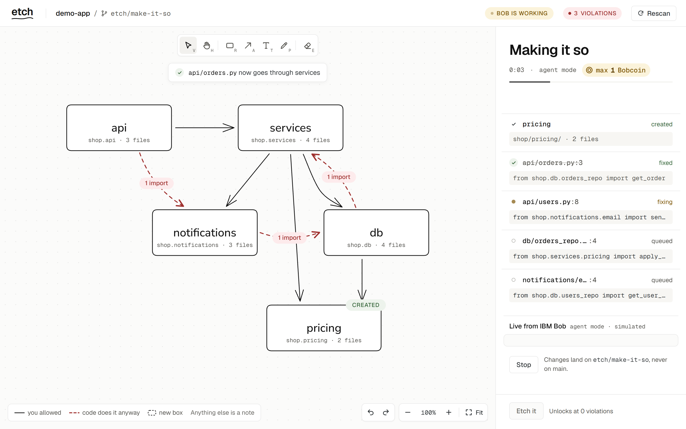
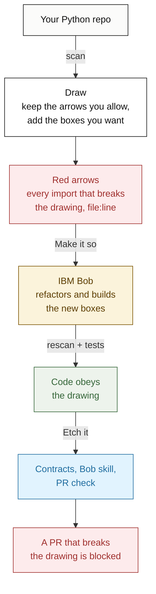
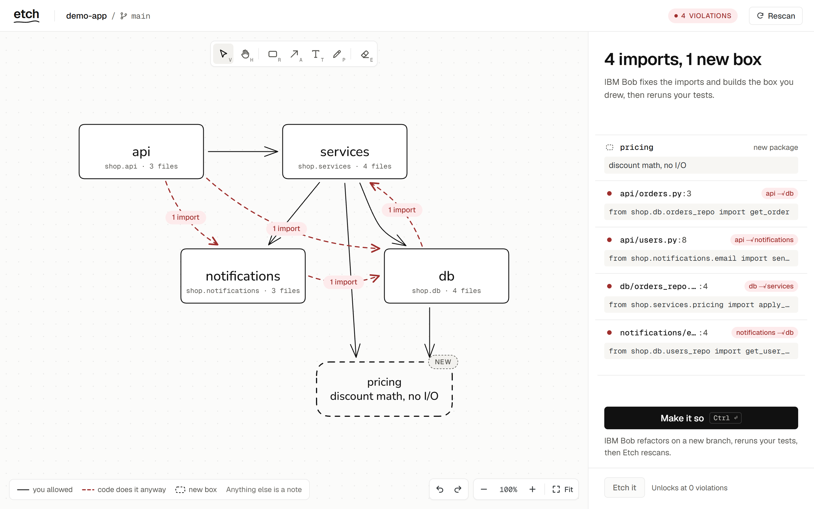
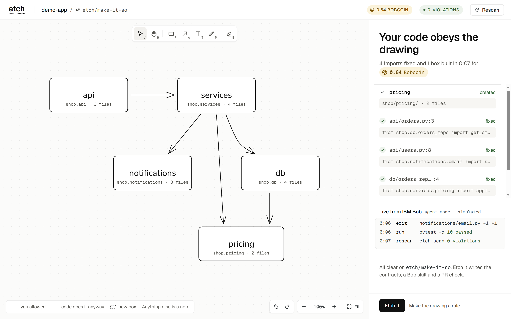
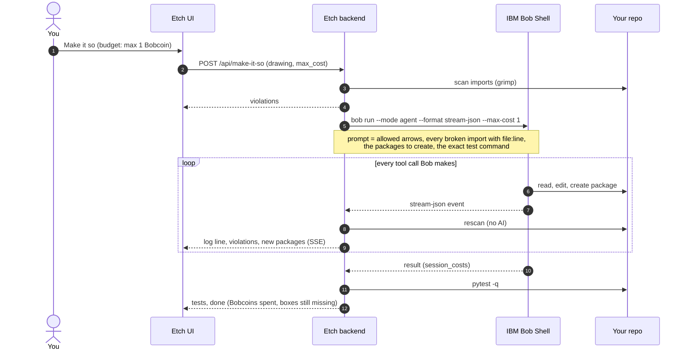
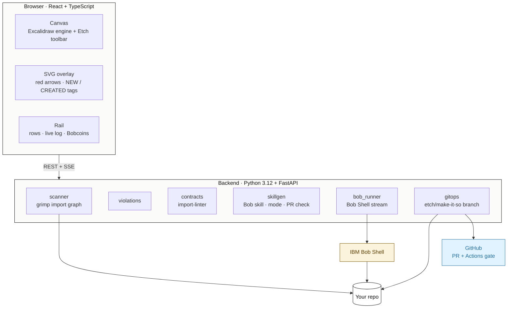

<div align="center">

# etch

### Doodle-driven development

Draw your architecture. IBM Bob makes the code obey. The drawing becomes a rule on every pull request.

[](#built-with-ibm-bob)
[](https://lablab.ai)
[](LICENSE)

**[How it works](#how-it-works)** &nbsp;·&nbsp; **[Proof it works](#proof-it-works)** &nbsp;·&nbsp; **[Built with IBM Bob](#built-with-ibm-bob)** &nbsp;·&nbsp; **[Run it](#run-it)**

<br/>



<sub>IBM Bob mid-run: the <code>pricing</code> box you drew has just become a real package, and the red arrows fade as each import is rerouted.</sub>

</div>

<br/>

## Table of contents

- [The problem](#the-problem)
- [What Etch does](#what-etch-does)
- [Features](#features)
- [How it works](#how-it-works)
- [Tech stack](#tech-stack)
- [Architecture](#architecture)
- [Proof it works](#proof-it-works)
- [Built with IBM Bob](#built-with-ibm-bob)
- [Run it](#run-it)
- [Project structure](#project-structure)
- [Tests](#tests)
- [Security](#security)

<br/>

## The problem

Every team has an architecture diagram, and it's usually wrong. Someone adds `from shop.db import ...` inside an API handler to ship a fix on Friday. The tests pass, review misses it, and six months later the layering on the whiteboard exists only on the whiteboard.

Tools like import-linter can enforce layers, but their config is hand-written and nobody maintains it. Fixing the drift is tedious refactoring that nobody schedules.

<br/>

## What Etch does



1. **Scan.** Point Etch at a Python repo. It reads every import with [grimp](https://github.com/seddonym/grimp), including the ones hidden inside functions, and draws the real architecture as boxes and arrows. Each top-level package is one box.
2. **Draw.** Erase the arrows you don't want. Every import that crosses a missing arrow turns into a red dashed arrow and a row with its `file:line` and code. Draw a **new box**, write the package name and what belongs there, and connect it: Etch treats it as a package to build.
3. **Make it so.** One button runs **IBM Bob** headless on the repo, capped at the Bobcoin budget you pick. Bob reroutes the imports and creates the new packages. Etch rescans after every change Bob makes, so red arrows fade and the dashed box turns into a real one while you watch, then reruns your tests.
4. **Etch it.** The drawing is compiled into `.importlinter` contracts, a GitHub Action that blocks pull requests which break it (no AI in that check, no cost), a **Bob skill** and **custom mode** that teach Bob the architecture and your notes, and `.etch/drawing.json`. **Open pull request** puts it all on `etch/make-it-so` without touching your checkout.

<br/>

## Features

<table>
<tr>
<td width="50%" valign="top">

### Your architecture, drawn from the code
Etch scans every import, including function-local ones, and lays the packages out as boxes. Each box shows its module and live file count.

</td>
<td width="50%" valign="top">

### Red arrows, down to the line
Anything the code does that you didn't draw appears as a red dashed arrow with an import count, and as a row with the exact `file:line` and code.

</td>
</tr>
<tr>
<td width="50%" valign="top">

### Draw a box, get a package
Draw a box, name it `pricing`, write "discount math, no I/O" under the name, and connect it. Bob creates `shop/pricing/`, moves the code that belongs there and rewrites every import.

</td>
<td width="50%" valign="top">

### Watch Bob work
Bob's stream plays in a live log. The count pill ticks down, a toast says where each import now goes, and the box you drew turns solid with a <b>CREATED</b> tag.

</td>
</tr>
<tr>
<td width="50%" valign="top">

### You set the budget
Pick the Bobcoin cap next to Make it so (0.25 to 3). The real cost is shown when Bob finishes and stays in the top bar.

</td>
<td width="50%" valign="top">

### A rule on every pull request
Etch it writes import-linter contracts and a GitHub Action. A PR that breaks the drawing fails its check, even when every test passes.

</td>
</tr>
</table>

<table>
<tr>
<td width="50%"></td>
<td width="50%"></td>
</tr>
<tr>
<td align="center"><sub>Before: 4 imports break the drawing, and a new <code>pricing</code> box is drawn</sub></td>
<td align="center"><sub>After: 4 imports fixed, 1 box built, cost shown</sub></td>
</tr>
</table>

<sub>Screenshots use <code>?simulate</code>, Etch's free rehearsal mode. It replays a scripted run and labels itself "simulated".</sub>

<br/>

## How it works

What happens when you press **Make it so**:



A run only counts as done when every broken import is gone, every drawn box is a real package, and the rescan succeeds. Otherwise Etch says what's left and offers **Undo changes**. **Stop** kills Bob's whole process tree.

<br/>

## Tech stack

<table>
<tr>
<td valign="top" width="25%">

**Frontend**


- React + TypeScript on Vite
- Excalidraw as the drawing engine, with Etch's own toolbar and controls
- SVG overlay for red arrows and tags
- Server-sent events for the live run

</td>
<td valign="top" width="25%">

**Backend**


- FastAPI + Pydantic v2
- grimp for the import graph with line numbers
- import-linter contracts, compiled from the drawing
- git plumbing for the PR branch

</td>
<td valign="top" width="25%">

**AI**


- IBM Bob in Bob IDE built Etch
- Bob Shell runs headless for Make it so
- A generated Bob skill and custom mode teach Bob the drawing

</td>
<td valign="top" width="25%">

**Quality & CI**


- `lint-imports` gate on every PR
- pytest + Vitest suites
- A fake Bob that speaks stream-json, so tests never spend Bobcoins

</td>
</tr>
</table>

<br/>

## Architecture



Etch obeys its own rule. `etch.models` imports nothing from `etch`, the engine modules import only `etch.models`, and only `etch.main` wires them together.

<br/>

## Proof it works

The demo repo (`demo-app/`) is a small shop app with four planted layering violations. One of them is an import hidden inside a function body.

- **Live Make it so:** IBM Bob fixed **4 of 4** violations in **1:24** for **0.61 Bobcoin**. All 10 tests passed afterwards, and `lint-imports` went from 3 broken contracts to 0. Bob's actual diff is in [`docs/demo/make_it_so_run1.patch`](docs/demo/make_it_so_run1.patch).
- **[PR #1](https://github.com/SolaimanK05/etch/pull/1)** has Bob's fix plus the etched rules. Its checks are green.
- **[PR #2](https://github.com/SolaimanK05/etch/pull/2)** is a realistic "quick fix" that reads orders straight from the database in the API. **Every test passes, and the merge is still blocked**: `api may only import: services BROKEN — shop.api.orders -> shop.db.orders_repo (l.3)`. The tests can't see architecture drift. The drawing can.

<br/>

## Built with IBM Bob

Bob is used in three places: it built Etch, it runs inside Etch, and Etch generates files for it.

**Bob built Etch.** IBM Bob wrote every core module in Agent mode. Each task started from a precise spec with frozen interfaces and a test suite written first. The specs are in [`docs/bob_prompts/`](docs/bob_prompts/) and the session summaries in [`bob_sessions/`](bob_sessions/).

| Task | What Bob built | Bobcoins |
|:-:|---|--:|
| 0 | Spike: headless `bob run` fixing one violation | 0.18 |
| 1 | Scaffold: FastAPI backend, Vite + React + Excalidraw frontend, demo app, AGENTS.md | 3.33 |
| 2 | Scanner and violation engine (grimp) | 0.80 |
| 3 | Contract compiler, Etch it endpoint, CI workflow | 0.70 |
| 6 | Demo shop app with four planted violations | 0.67 |
| 4a | Canvas logic: geometry, drawing sync, UI state machine | 2.38 |
| 4b | The full UI, ported from the approved design | 8.74 |
| 5 | Live runner: Bob Shell stream, rescans, Stop, Undo | 3.79 |
| 7 | Bob skill and mode, PR check, notes, Open pull request | 3.10 |
| 8a | Draw a box = new package: detection, prompt, live adoption, backend | 6.44 |
| 8b | Etch's canvas controls: toolbar, undo, zoom, fit | 0.58 |
| | **Total to build Etch** | **30.71** |

**Bob runs inside Etch.** Make it so starts Bob Shell (`bob run --mode agent --format stream-json --max-cost <your budget>`) with a generated prompt. The prompt contains the allowed arrows, every broken import with its `file:line` and code, the packages to create and what belongs in them, and the exact test command. Etch parses Bob's event stream into the live log, rescans after each tool result, and reports the Bobcoin cost from Bob's final `result` event.

**Etch generates files for Bob.** Etch it writes `.bob/skills/etch-architecture/SKILL.md` and an "Etch Architect" mode in `.bob/custom_modes.yaml`. Anyone who opens the repo in Bob afterwards gets an agent that knows the architecture and the reasons behind it, including the notes you wrote on the canvas.

<br/>

## Run it

Requirements: Python 3.12, Node 20.19+ (or 22.12+), git, and IBM Bob Shell (`bob`) with `BOB_API_KEY` set in your environment. Etch never writes the key to disk. The commands below are for Windows.

**1. Backend**

```
cd backend
py -3.12 -m venv .venv
.venv\Scripts\python.exe -m pip install -e ".[dev]"
.venv\Scripts\python.exe -m uvicorn etch.main:app --port 8000
```

**2. Frontend** (in a second terminal)

```
cd frontend
npm install
npm run dev
```

**3. Try it.** Open http://localhost:5173, type `demo-app` and click **Scan**. Then:
- Erase the arrows `api → db`, `api → notifications`, `db → services` and `notifications → db`.
- Optionally, draw a box, double-click it and type `pricing`, then on a new line `discount math, no I/O`. Draw arrows into it from `services` and `db`.

- **Rehearse without spending Bobcoins:** open http://localhost:5173/?simulate.
- **Reset the demo after a live run:** `git checkout -- demo-app`, then `git clean -fd demo-app`.

<br/>

## Project structure

```text
etch/
├── backend/etch/        FastAPI: scanner, violations, contracts, skillgen, bob_runner, gitops
│   └── tests/           pytest, incl. a fake Bob that speaks stream-json
├── frontend/src/
│   ├── components/      Canvas, CanvasControls, ViolationOverlay, Rail, Rows, LogPanel, TopBar
│   └── lib/             drawing, state machine, run stream, simulate, canvas controls
├── demo-app/            the shop app Etch is demoed on (4 planted violations)
├── docs/
│   ├── bob_prompts/     the spec for every Bob task
│   ├── design/          approved design, prototype and v2 mockup
│   └── demo/            screenshots, Bob's live diff, CI evidence
├── bob_sessions/        IBM Bob task summaries
└── .github/workflows/   the architecture gate
```

<br/>

## Tests

| Suite | Command | Result |
|---|---|---|
| Backend | `backend\.venv\Scripts\python.exe -m pytest -q backend` | 79 passed |
| Frontend | `npm test` in `frontend/` | 63 passed |
| Demo app | `backend\.venv\Scripts\python.exe -m pytest -q demo-app` | 10 passed |

The runner is tested against a fake Bob ([`backend/tests/fixtures/fake_bob.py`](backend/tests/fixtures/fake_bob.py)) that speaks Bob's stream-json format, including a mode that builds a drawn box. The test suite never spends Bobcoins.

<br/>

## Security

- No credentials live in this repo. Bob Shell reads `BOB_API_KEY` from the environment.
- Box names are validated as lowercase Python package names before they reach Bob, and the Bobcoin cap is bounded to (0, 5].
- `.gitignore` and `.bobignore` are the hackathon template's, extended only below their markers. See [SECURITY.MD](SECURITY.MD).

<br/>

<div align="center">

---

**Etch**: draw the architecture, and IBM Bob makes the code obey.

Built for the IBM Bob 2.0 Hackathon · [MIT License](LICENSE)

</div>
