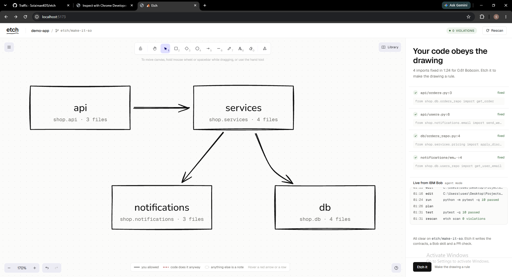

# Etch: doodle-driven development

**Draw your architecture. IBM Bob makes the code obey. The drawing becomes a rule on every pull request.**



## The problem

Every team has an architecture diagram, and it's usually wrong. Someone adds `from shop.db import ...` inside an API handler to ship a fix on Friday. The tests pass, review misses it, and six months later the layering on the whiteboard exists only on the whiteboard.

Tools like import-linter can enforce layers, but their config is hand-written and nobody maintains it. Fixing the drift is tedious refactoring that nobody schedules.

## What Etch does

1. **Scan.** Point Etch at a Python repo. It reads every import (with [grimp](https://github.com/seddonym/grimp)), including the ones hidden inside functions, and sketches the real architecture as hand-drawn boxes and arrows.
2. **Draw.** Erase the arrows you don't want. Every import that crosses a missing arrow turns into a red dashed arrow, and appears in a list with its `file:line` and the offending line of code.
3. **Make it so.** One button runs **IBM Bob** headless on the repo. The refactor streams into the UI as it happens: Etch rescans after every change Bob makes, red arrows fade as imports are rerouted, and Etch reruns your tests at the end.
4. **Etch it.** The drawing is compiled into:
   - `.importlinter` contracts
   - a GitHub Action that blocks any pull request that breaks the drawing (no AI in that check, no cost)
   - a **Bob skill** and a **Bob custom mode** that teach Bob the architecture, including the notes you wrote on the canvas
   - `.etch/drawing.json`, the sketch itself

   **Open pull request** puts the result on the branch `etch/make-it-so` without touching your checkout.

Anything you draw that isn't a code box or an arrow between two boxes is a note. Notes are carried into the Bob skill as the architect's reasoning.

## Proof it works

The demo repo (`demo-app/`) is a small shop app with four planted layering violations. One of them is an import hidden inside a function body.

- **Live Make it so:** IBM Bob fixed **4 of 4** violations in **1:24** for **0.61 Bobcoin**. All 10 tests passed afterwards, and `lint-imports` went from 3 broken contracts to 0. Bob's actual diff is in [`docs/demo/make_it_so_run1.patch`](docs/demo/make_it_so_run1.patch).
- **[PR #1](https://github.com/SolaimanK05/etch/pull/1)** has Bob's fix plus the etched rules. Its checks are green.
- **[PR #2](https://github.com/SolaimanK05/etch/pull/2)** is a realistic "quick fix" that reads orders straight from the database in the API. **Every test passes, and the merge is still blocked**: `api may only import: services BROKEN — shop.api.orders -> shop.db.orders_repo (l.3)`. The tests can't see architecture drift. The drawing can.

## How IBM Bob is used

Bob is used in three places: it built Etch, it runs inside Etch, and Etch generates files for it.

**Bob built Etch.** Every core module was written by IBM Bob in Agent mode. Each task started from a precise spec with frozen interfaces and a test suite written beforehand. The specs are in [`docs/bob_prompts/`](docs/bob_prompts/), and the session summaries are in [`bob_sessions/`](bob_sessions/).

| Task | What Bob built | Bobcoins |
|---|---|---|
| 0 | Spike: headless `bob run` fixing one violation | 0.18 |
| 1 | Scaffold: FastAPI backend, Vite + React + Excalidraw frontend, demo app, AGENTS.md | 3.33 |
| 2 | Scanner and violation engine (grimp) | 0.80 |
| 3 | Contract compiler, Etch it endpoint, CI workflow | 0.70 |
| 6 | Demo shop app with four planted violations | 0.67 |
| 4a | Canvas logic: geometry, drawing sync, UI state machine | 2.38 |
| 4b | The full UI, ported from the approved design | 8.74 |
| 5 | Live runner: Bob Shell stream, rescans, Stop, Undo | 3.79 |
| 7 | Bob skill and mode, PR check, notes, Open pull request | 3.10 |

**Bob runs inside Etch.** "Make it so" starts Bob Shell (`bob run --mode agent --format stream-json --max-cost 1`) with a generated prompt. The prompt contains the allowed arrows, every broken import with its `file:line` and code, and the exact test command to verify with. Etch parses Bob's event stream into the live log, rescans after each tool result, and reports the Bobcoin cost from Bob's final `result` event. Every run is capped at 1 Bobcoin, and Stop kills Bob's whole process tree.

**Etch generates files for Bob.** Etch it writes `.bob/skills/etch-architecture/SKILL.md` and an "Etch Architect" mode in `.bob/custom_modes.yaml`. Anyone opening the repo in Bob afterwards gets an agent that knows the architecture and the reasons behind it.

## Run it (Windows)

Requirements: Python 3.12, Node 20.19+ (or 22.12+), git, and IBM Bob Shell (`bob`) with `BOB_API_KEY` set in your environment. Etch never writes the key to disk.

```
cd backend
py -3.12 -m venv .venv
.venv\Scripts\python.exe -m pip install -e ".[dev]"
.venv\Scripts\python.exe -m uvicorn etch.main:app --port 8000
```

```
cd frontend
npm install
npm run dev
```

Open http://localhost:5173, type `demo-app`, click **Scan**, and erase the arrows `api → db`, `api → notifications`, `db → services` and `notifications → db`.

- **To rehearse without spending Bobcoins,** open `http://localhost:5173/?simulate`. It replays a scripted run and labels itself "simulated".
- **To reset the demo after a run:** `git checkout -- demo-app` then `git clean -fd demo-app`.

## Tests

| Suite | Command | Result |
|---|---|---|
| Backend | `backend\.venv\Scripts\python.exe -m pytest -q backend` | 65 passed |
| Frontend | `npm test` in `frontend/` | 43 passed |
| Demo app | `backend\.venv\Scripts\python.exe -m pytest -q demo-app` | 10 passed |

The runner is tested against a fake Bob ([`backend/tests/fixtures/fake_bob.py`](backend/tests/fixtures/fake_bob.py)) that speaks Bob's stream-json format, so the test suite never spends Bobcoins.

## Layout

```
backend/etch/    FastAPI: scanner, violations, contracts, skillgen, bob_runner, gitops
frontend/src/    React + Excalidraw canvas, SVG violation overlay, rail, state machine
demo-app/        the shop app Etch is demoed on
docs/            plan, design spec and mockups, Bob task specs, demo evidence
bob_sessions/    IBM Bob task summaries
```

Etch obeys its own rule: `etch.models` imports nothing from `etch`, the engine modules import only `etch.models`, and only `etch.main` wires them together.

## Security

No credentials live in this repo. Bob Shell reads `BOB_API_KEY` from the environment. `.gitignore` and `.bobignore` are the hackathon template's, extended only below their markers. See [SECURITY.MD](SECURITY.MD).

## License

[MIT](LICENSE)
